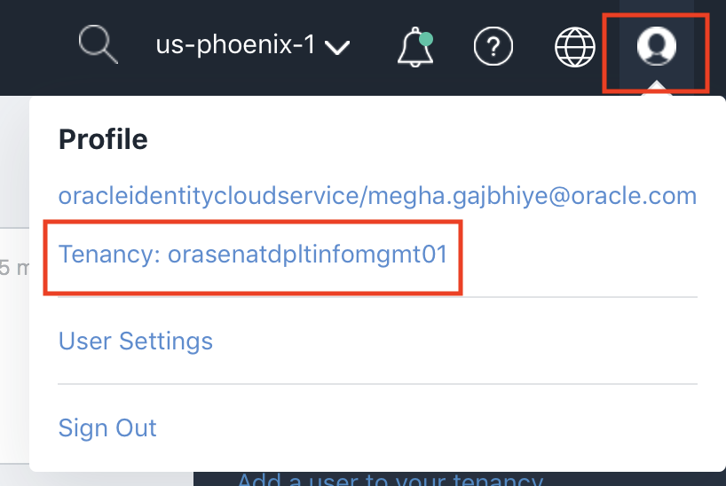
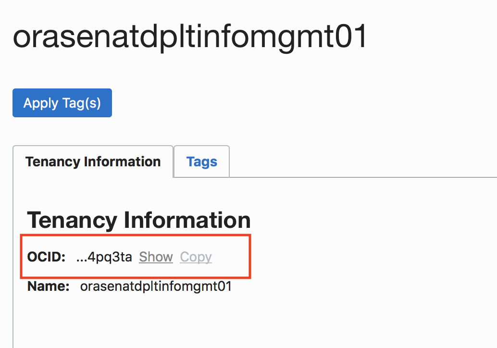
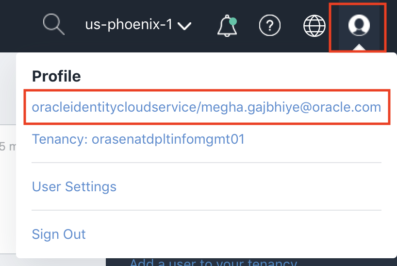
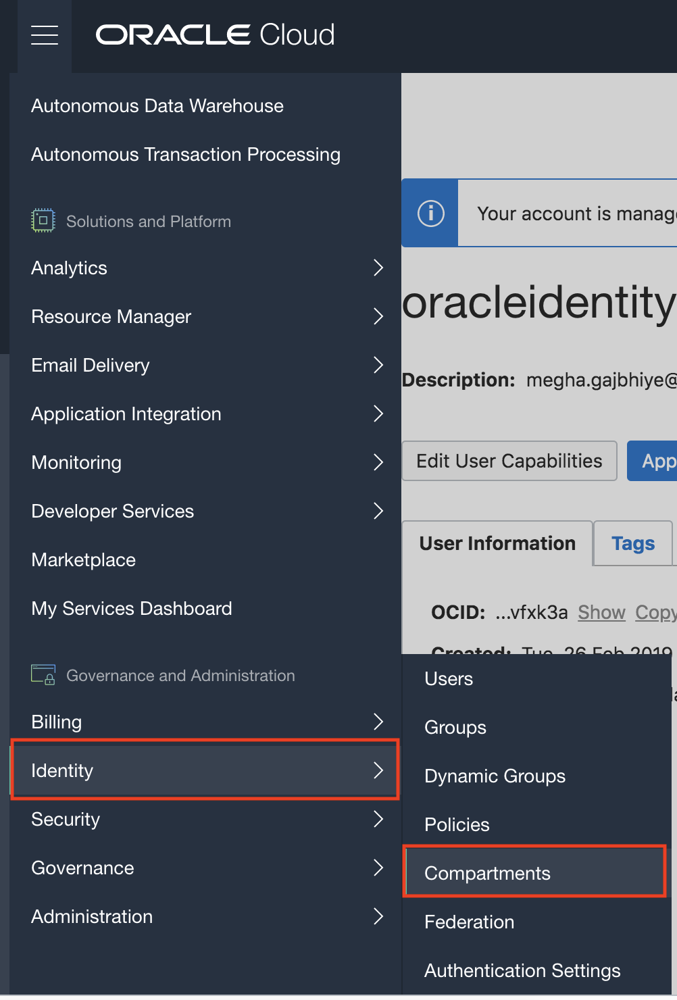
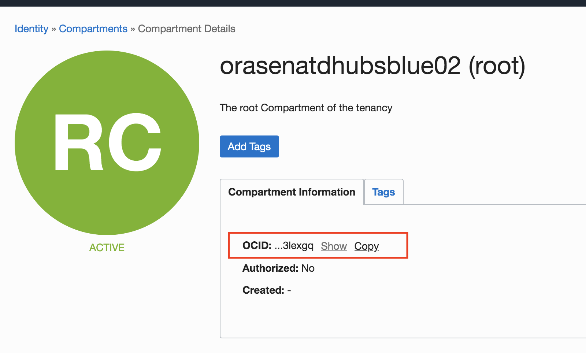

# List and update Autonomous Database instance in your cloud environment from Rest API using nodejs.

# Objective:

Oracle Cloud Infrastructure REST APIs implemented in node.js to list, and update an autonomous database instance.  

## Prerequisites:

- Make sure that you have an Autonomous Database up and running.    
- Make sure that you have nodejs configured in your machine.
- Follow this document to Generate an API Signing Key and to upload the Public Keys in User profile . 
  https://docs.cloud.oracle.com/iaas/Content/API/Concepts/apisigningkey.htm 
- Clone the repository: 
   **git clone https://github.com/austindatamanagement/nodejs_autonomousDB.git**

## **STEP 1**: Change some parameters as per your environment in the code.

After cloning the Git repository, navigate to nodejs_autonomousDB folder and then to test.js file. Open it to edit. 

- **Change the following in this part of the code:**

  **var auth={  
      tenancyId : 'ocid1.tenancy.oc1..aaaaaaaa3hjb76kw5fmhm6y4tcl5whv2uer6fz2bbfctfxvbdrtwddfdo6qq',  
      userId : 'ocid1.user.oc1..aaaaaaaaot7m2xmy4kk55bltdtuyt32eaht7s7aoc2le6ui4xgg56qcw272a',  
      keyFingerprint : 'a1:84:3b:8a:28:8a:d6:dc:8e:28:33:26:a6:bf:1b:a9',  
      RESTversion : '/20160918',  
      region: 'eu-frankfurt-1'  
  };**  
  
  
  1. **tenancyId** : Your Tenancy OCID. 
  
    - Navigate to the profile on the top right of your Cloud Account and click on "Tenancy".
     
       
       
    - Copy the OCID
     
       
       
   2. **userID** : Your user OCID. 
  
     - Navigate to the profile on the top right of your Cloud Account and click on your profile name.
     
       
       
     - Copy the OCID. 
     
       
  
  3. **keyFingerprint** : 
  
     You can get the key's fingerprint with the following OpenSSL command. If you're using Windows, you'll need to install Git Bash for Windows and run the command with that tool . 

     "openssl rsa -pubout -outform DER -in {Path to your PEM file} | openssl md5 -c"

     My .pem file is in ~/.oci, so my command is :
     
     "openssl rsa -pubout -outform DER -in ~/.oci/oci_api_key.pem | openssl md5 -c"

     When you upload the public key in the Console, the fingerprint is also automatically displayed there. It looks something like this: 12:34:56:78:90:ab:cd:ef:12:34:56:78:90:ab:cd:ef 
  
  4. **region** : Region where your autonomous database instance is up and running.   
  
     To get the region, navigate to the top right of your Cloud Console. 
     
     

- **Change the following in this part of the code:**
  
  **auth.privateKey = fs.readFileSync('path to your .pem', 'ascii');**

  1. **path to your .pem** : Change this to the path of your private key .pem.
  
- **Change the following in this part of the code:**

  **var parameters = {compartmentId : 'ocid1.tenancy.oc1..aaaaaaaa3hjb76kw5fmhm6y4tcl5whv2uer6fz2bbfctfxvbdrtwddfdo6qq'};**  

  1. **compartmentId** : your compartment OCID.
  
      - Navigate to "Identity" -> "Compartment"
      
      
      
      - Click on your compartment and copy the OCID 
      
      
      
      
   See the test.js and files in the examples directory for other examples of how to setup the auth an how to call/use the API.

## **STEP 2**: Run the script.

Now run the script by typing the following:

**node test.js** 

you should be able to see the list of the autonomous database running in your instance. 

## **STEP 3** Update your autonomous instance. 

This step will update the autonomous instance through rest API. We will add tags to the existing autonomous database instance.

In order to do so, uncomment the following part of the code:

**var tags = { "freeformTags" : {"tag1": 123456, "tag2": "yyy", "anotherTag": "aaa" }};  
  parameters = {  
    body : tags,  
    autonomousDataWarehouseId : adwId  
}  
oci.database.autonomousDataWarehouse.update( auth, parameters, callback );**  

And change the following parameter: 

 1. **autonomousDataWarehouseId**: OCID of your Autonomous Database. 
 
Run the script, and you will see that further tags are added.

